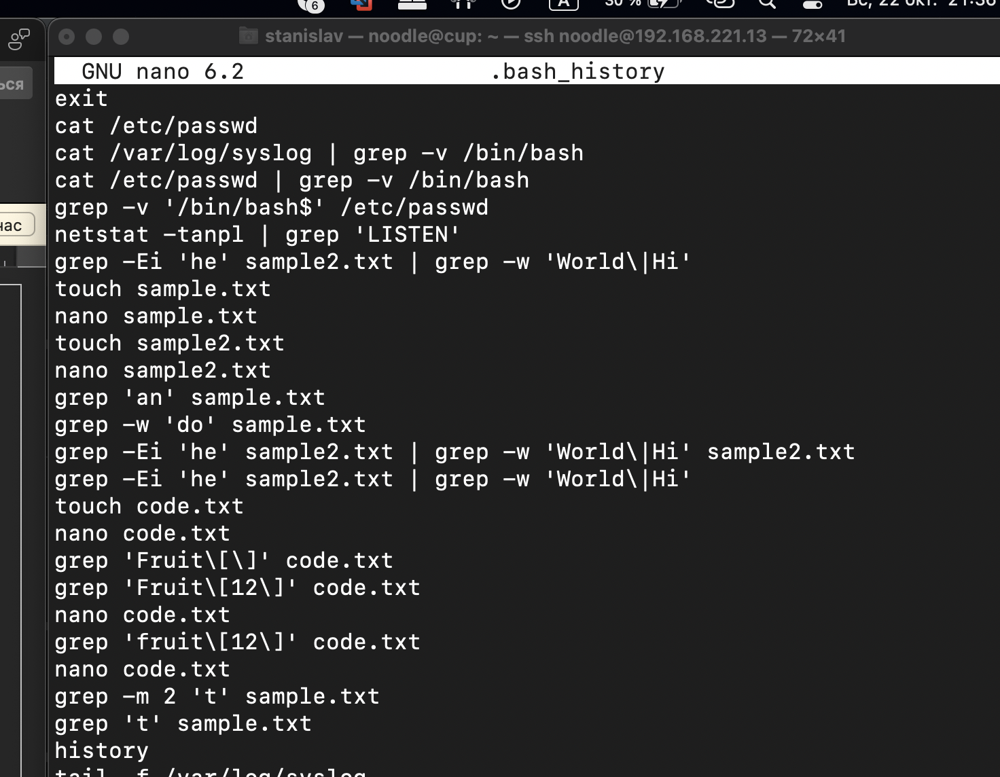

Песецкий Станислав - вар.12
===============
### ЛАБОРАТОРНАЯ РАБОТА: grep
\
**Цель:** Ознакомление с командой grep, использование ее функционала на практике.
\
\
\
**Выполнение:**
1.	Отобразить файл /etc/passwd, который не содержит /bin/bash в конце строки?
>**cat /etc/passwd | grep -v '/bin/bash$'** \
Эта команда использует cat для отображения содержимого файла /etc/passwd, а затем grep
-v '/bin/bash$' фильтрует строки, не содержащие /bin/bash в конце.
2.	Выведите результат команды "netstat -tanpl" в колонке status у которых стоит 'LISTEN'.
>**netstat -tanpl | grep 'LISTEN'** \
Эта команда использует netstat -tanpl для вывода всех открытых сетевых соединений,
а затем grep 'LISTEN' фильтрует строки, содержащие 'LISTEN'.
3.	Выведите строки, содержащие an в фале sample.txt.
>**grep 'an' sample.txt** \
Эта команда использует grep 'an' для поиска строк, содержащих "an" в файле sample.txt.
4.	 Выведите строки, содержащие do как целое слово в sample.txt.
>**grep -w 'do' sample.txt** \
Эта команда использует grep -w 'do' для поиска строк, содержащих "do" как целое слово в файле sample.txt. (-w = word)
5.	 Отобразите строки из файла sample2.txt, удовлетворяющие обоим этим условиям:
    *	he совпадает независимо от случая (часть или целое слово)
    * Слова World и Hi чувствительны к регистру
>**grep -Ei 'he' sample2.txt | grep -w 'World\\|Hi'** \
Эта команда использует grep -Ei 'he' для поиска строк с "he" (без учета регистра) и
затем grep -w 'World\|Hi' фильтрует строки, содержащие "World" или "Hi" (учитывая регистр).
(-E = Regular Expressions ; -i = ignore)
6.	 Отображать строки из code.txt, содержащие Fruit[<номер по списку>] буквально.
>**grep 'fruit\\[12\\]' code.txt**\
Эта команда использует grep 'Fruit\[\d+\]' для поиска строк, содержащих "Fruit[12]" в файле code.txt.
7.	 Отобразите только первые две совпадающие строки, содержащие t из входного файла sample.txt.
>**grep -m 2 't' sample.txt**\
Эта команда использует grep -m 2 't' для вывода первых двух совпадающих строк,
содержащих "t" в файле sample.txt.(-m = max count)
>
\
\
\
**В файле *.bash_history:***
